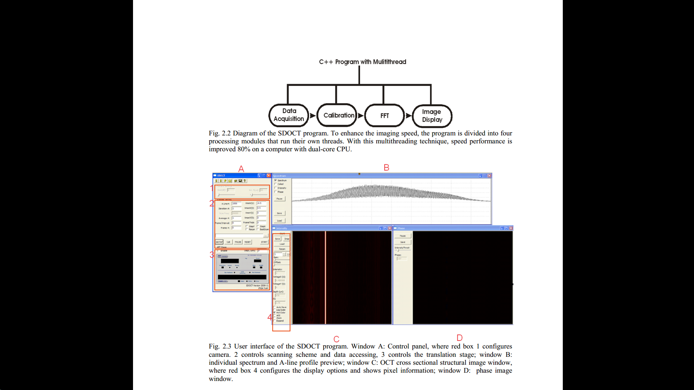

# OpenOCT
OCT software package that includes data acquisition, image reconstruction, and displaying, written in C++ with multi-thread support.

The package was written and built using visual studio 2005.
below is the screenshot

